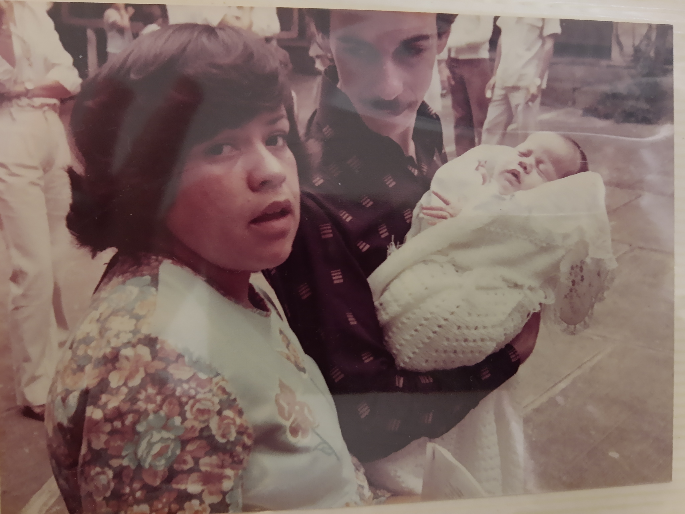

```{r child = "setup.Rmd"}
```

```{r xaringan-tile-view, echo=FALSE}
xaringanExtra::use_tile_view()
```

```{r xaringan-editable, echo=FALSE}
xaringanExtra::use_editable(expires = 1)
```

```{r xaringan-panelset, echo=FALSE, message=FALSE, warning=FALSE}
xaringanExtra::use_panelset()
xaringanExtra::style_panelset_tabs(panel_tab_font_family = "sans-serif")
```

```{r xaringanExtra-clipboard, echo=FALSE}
htmltools::tagList(
  xaringanExtra::use_clipboard(
    button_text = "<i class=\"fa fa-clipboard\"></i>",
    success_text = "<i class=\"fa fa-check\" style=\"color: #90BE6D\"></i>",
    error_text = "<i class=\"fa fa-times-circle\" style=\"color: #F94144\"></i>"
  ),
  rmarkdown::html_dependency_font_awesome()
)
```

```{r xaringan-fit-screen, echo=FALSE}
xaringanExtra::use_fit_screen()
```

```{r xaringan-extra-styles, echo=FALSE}
xaringanExtra::use_extra_styles(
  hover_code_line = TRUE,         #<<
  mute_unhighlighted_code = TRUE  #<<
)
```

```{css include=FALSE}
.panelset {
   --panel-tab-foreground: currentColor;
   --panel-tab-background: unset;
   --panel-tab-active-foreground: currentColor;
   --panel-tab-active-background: unset;
   --panel-tab-active-border-color: currentColor;
   --panel-tab-hover-foreground: currentColor;
   --panel-tab-hover-background: unset;
   --panel-tab-hover-border-color: currentColor;
   --panel-tab-inactive-opacity: 0.5;
   --panel-tabs-border-bottom: #ddd;
   --panel-tab-font-family: Sen;
   --panel-tab-background-color-active: #fffbe0;
   --panel-tab-border-color-active: #023d4d;
}

.panelset .panel-tabs .panel-tab > a {
	color: #023d4d;
}

.panelset .panel-tabs {
  font-size: 0.5rem;
}
```

name: xaringan-title
class: left, middle
background-image: url(img/flower3.jpg)
background-size: cover

.larger[

Sobre reduzir distâncias...
]

.pink[
.huge[
Memorial para promoção a professora titular do CEFET-MG
]
]

Renata Lúcia Magalhães de Oliveira

15/06/2021

---

background-image: url(img/flower2.jpg)
background-size: cover

# Agenda


.bold[
.pull-left[
Quem sou

Origens

Caminhos acadêmicos

Eu e o CEFET-MG
]
]

.bold[
.pull-right[
Para onde vou

Manifesto e onde mora o coração

Agradecimentos
]
]


---

class: center, middle
background-image: url(img/i.jpg)
background-size: cover


---

# That's 70s show

```{r pais, echo=FALSE, fig.cap="1979", out.width="57%"}

```  


---
class: middle, center
background-image: url(img/heart.jpg)
background-size: cover

.pull-left[
```{r reta-baby-1, echo=FALSE, fig.cap="", out.width="80%"}

```
]


---

class: middle, center
background-image: url(img/swim.jpg)
background-size: cover


---

class: center
background-image: url(img/idaho.jpg)
background-size: cover

--

.pull.right[
.small[
```{r echo=FALSE, fig.cap="", out.width="10%", fig.align='right'}
knitr::include_graphics("img/idaho.png")
```
]
]

---

background-image: url(img/teach.jpg)
background-size: cover


---

background-image: url(img/eng.jpg)
background-size: cover

---


background-image: url(img/all1.jpg)
background-size: cover

---

class: inverse, center

.link_style[

[Lattes](http://lattes.cnpq.br/2642488704355833)

[Orcid](https://orcid.org/0000-0002-9011-2342)

[Google Scholar](https://scholar.google.com/citations?user=V6EX45EAAAAJ)

[CV](https://github.com/retaoliveira/relements/raw/main/texto/index.pdf)

]

E podemos conversar ou trabalhar juntos. Encontre-me em
<a href="https://twitter.com/retaoliveira" target="_blank" rel="noopener" style="color:#447178"><ion-icon name="logo-twitter"></ion-icon></a>, <a href="https://github.com/retaoliveira" target="_blank" rel="noopener" style="color:#447178"><ion-icon name="logo-github"></ion-icon></a>,
e
<a href="mailto:renataoliveira@gmail.com" target="_blank" rel="noopener" style="color:#447178"><ion-icon name="mail-unread-outline"></ion-icon></a>


```{html echo=FALSE}
<script src="https://unpkg.com/ionicons@5.0.0/dist/ionicons.js"></script>
```

<hr> 

Este documento foi construído com o
<a href="https://retaoliveira.github.io/blog" target="_blank" rel="noopener" style="color:#447178"><ion-icon name="heart-outline"></ion-icon></a>,
<a href="https://github.com/retaoliveira" target="_blank" rel="noopener" style="color:#447178"><ion-icon name="logo-github"></ion-icon></a>, <a href="https://cran.r-project.org" target="_blank" rel="noopener" style="color:#447178"><i class="fab fa-r-project"></i></a> e
<a href="https://bookdown.org" target="_blank" rel="noopener" style="color:#447178">xaringan</a>.
</p>
