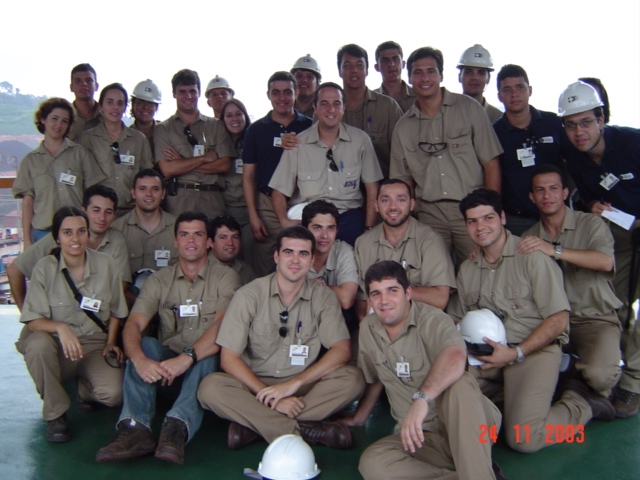
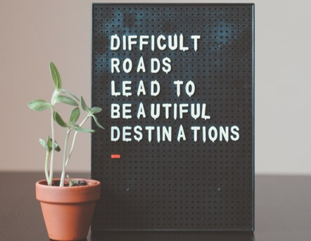
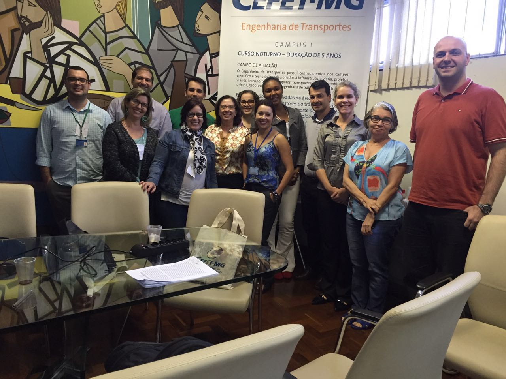
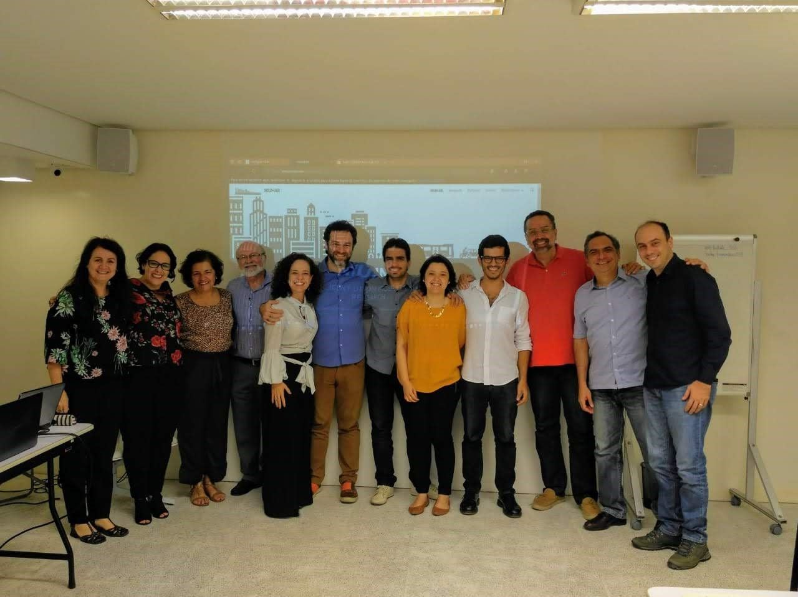
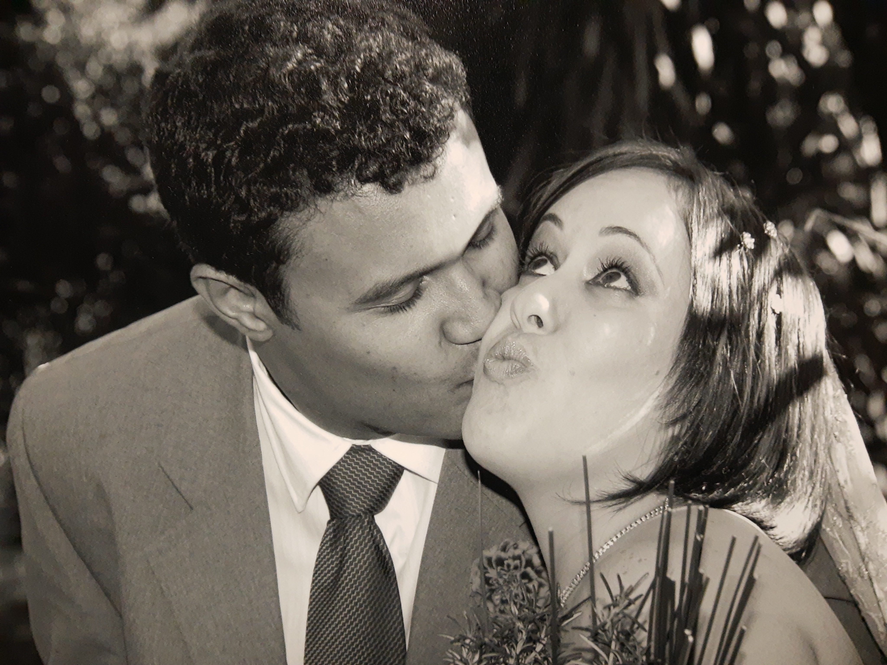
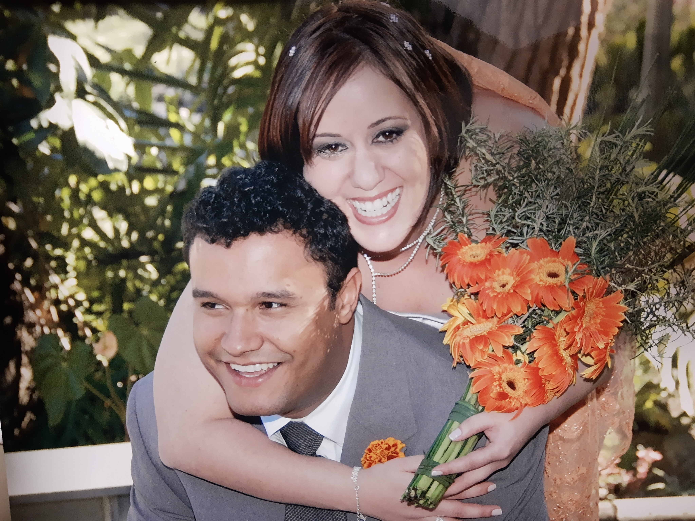
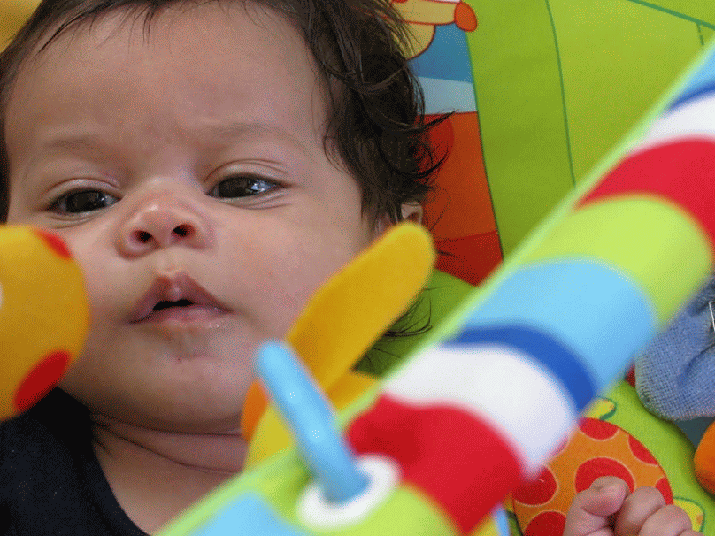
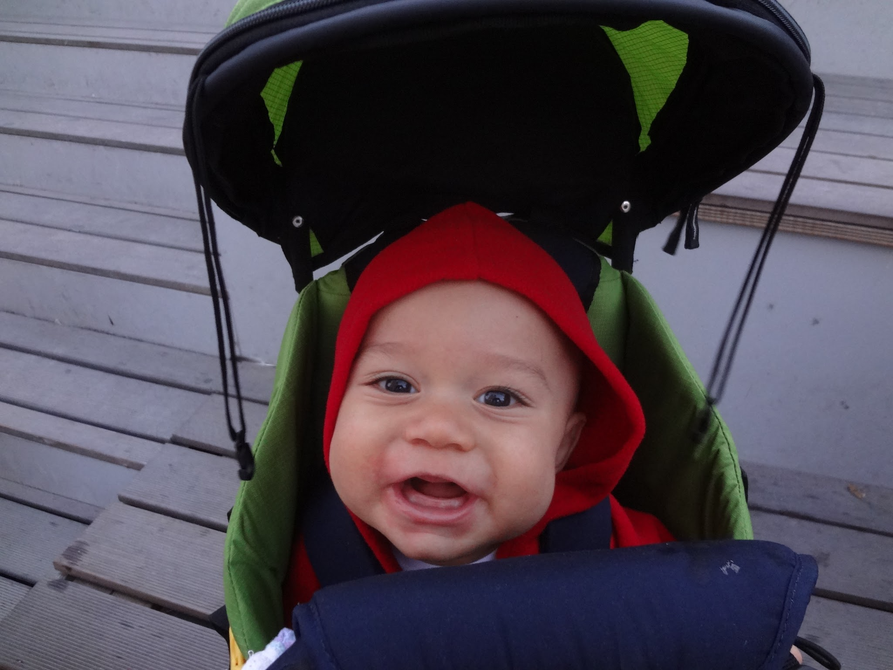

```{r child = "setup.Rmd"}
```

name: xaringan-title
class: left, middle
background-image: url(img/flower3.jpg)
background-size: cover

.larger[

Sobre reduzir distâncias...
]

.pink[
.huge[
Memorial para promoção a professora titular do CEFET-MG
]
]

Renata Lúcia Magalhães de Oliveira

15/06/2021

---

background-image: url(img/flower2.jpg)
background-size: cover

# Agenda


.bold[
.pull-left[
Quem sou

Origens

Caminhos acadêmicos

Eu e o CEFET-MG
]
]

.bold[
.pull-right[
Para onde vou

Manifesto e onde mora o coração

Agradecimentos
]
]


---

class: center, middle
background-image: url(img/i.jpg)
background-size: cover


---

# That's 70s show

```{r pais, echo=FALSE, fig.cap="1979", out.width="57%"}
knitr::include_graphics("img/pais.jpg")
```  


---
class: middle, center
background-image: url(img/heart.jpg)
background-size: cover

.pull-left[
```{r reta-baby-1, echo=FALSE, fig.cap="", out.width="80%"}
knitr::include_graphics("img/gecy.jpg")
```
]


---

class: middle, center
background-image: url(img/swim.jpg)
background-size: cover


---

class: center
background-image: url(img/idaho.jpg)
background-size: cover

.pull.right[

```{r echo=FALSE, fig.cap="", out.width="10%", fig.align='right'}
knitr::include_graphics("img/idaho.png")
```

]

---

background-image: url(img/teach.jpg)
background-size: cover


---

background-image: url(img/eng.jpg)
background-size: cover

---

class: bottom, center
background-image: url(img/all1.jpg)
background-size: cover

.green[
.larger[
Identidade como engenheira
]
]

---

class: center, middle
background-image: url(img/room1.jpg)
background-size: cover

.pink[
.larger[
Representação discente
]
]

---

background-image: url(img/mobility.jpg)
background-size: cover

# Iniciação científica


.bold[
.pull-left[
“Mobilidade Residencial e Sistema de Transporte na Região Metropolitana de Belo Horizonte” 


Prof. David José Ahouagi Vaz de Magalhães
]
]


---

class: bottom, center
background-image: url(img/transport.jpg)
background-size: cover


.yellow[
.larger[
Engenharia de transportes
]
]

---

class: bottom, center
background-image: url(img/forma.jpg)
background-size: cover

.yellow[
.larger[
 2001/2002
]]

---

background-image: url(img/ime.jpg)
background-size: cover


# Mestrado

.yellow[
.pull-left[
.large[
Instituto Militar de Engenharia

]
]
]

<br></br>
<br></br>
<br></br>
<br></br>

.center[
.larger[
.yellow[
2002
]]]

---

background-image: url(img/change1].jpg)
background-size: cover

.larger[
2003
]

--

.pull-left[
.large[
.bold[
Tectran - Ramón Vitor César   
]]]

--

.pull-left[
.large[
.bold[
Faculdade Novos Horizontes   
]]]

--

.pull-left[
.large[
.bold[
Vale - Engenharia Ferroviária
]
]
]

---

.pull-left-wide[
```{r vale, echo=FALSE, fig.cap="", out.width="100%"}

```
]

.pull-right-narrow[
.bold[

Estudos operacionais
]


Análise do Aumento de Confiabilidade das Locomotivas da Rota do Grão a Partir da Implantação do Novo Quadro de Tração da FCA


.bold[

VPL

PPC

]
]

---

background-image: url(img/master.jpg)
background-size: cover

.larger[
2004
]

.large[
Modelo Neuro-Fuzzy para Escolha Modal no Transporte de Cargas
]

Orientação: *Marcus Vinícius Quintella Cury*

.center[
.larger[
.pink[
Subjetividade no processo decisório
]]]

---


.pull-left[
.large[
.larger[
2005
]
.bold[
Faculdade Novos Horizontes   

Fundação Comunitária de Ensino Superior de Itabira

Departamento de Engenharia de Transportes e Geotecnia - UFMG
]
]
]

.pull-right[
```{r , echo=FALSE, fig.cap="", out.width="100%"}

```
.center[
.green[
Concurso para CEFET-MG
]
]
]


---

background-image: url(img/cefet1.png)

.larger[

2006 - 2009
]


.bold[
Cursos técnicos em Transportes e Trânsito
]

--

.bold[
Coordenação de laboratórios
]

--

.bold[
Coordenação de cursos
]

--

.bold[
Engenharia de transportes


]

---

background-image: url(img/puc.png)
background-size: container

.larger[
2010-2015
]


.bold[
.large[
Geografia - Tratamento da informação espacial   
]]

*Oswaldo Bueno Amorim Filho*   
*Alexandre Magno Alves Diniz*

.bold[
.large[
Período sanduíche no Institut Rhônalpin des Systèmes Complexes   
]
]

*Prof. Pablo Jensen*


---


background-image: url(img/mps.jpg)
background-size: cover


.larger[
2015
]

.bold[
.large[
Análise Espacial dos Preços de Produtos Alimentícios no Varejo de Belo Horizonte e sua relação com a renda média da população   
Orientação: *Alexandre Magno Alves Diniz*

]]

.center[
.larger[
.pink[
Acessibilidade
]]]

---

# 2017 - 2021

.bold[
Programa de mestrado em Geotecnia e Transportes da UFMG   
]

.midi[
-   Clarissa Pontes Melo - Análise da macroacessibilidade de pedestres idosos sob a ótica da qualidade do espaço urbano. 2021.

-   André Augusto Cunha Libânio - Avaliação da acessibilidade em cidades brasileiras. 2020.

-   Paulo Henrique Góes Pinto - Identificação e qualificação de centralidades urbanas por meio de estrutura morfológico-funcional: um estudo de caso para a RMBH. 2020.

-   José Moreira Gonçalves - Atração de Viagens de Carga em Indústria Automobilística de Máquinas Agrícolas e Rodoviárias. 2019.

-   Gabriela Pereira Lopes - Uma Análise da Localização de Instalações Logísticas versus Geração de Viagens e os Impactos na mobilidade urbana em Belo Horizonte. 2018.
]

---

background-image: url(img/cefet1.png)

.bold[
.larger[
2015 - 2019  
]]

Departamento de Engenharia de Transportes   
Sub-coordenação e depois coordenação da Engenharia de Transportes   
Introdução à Engenharia de Transportes ❤️   
Alunos de Iniciação Científica e Iniciação Científica Júnior

.pull-right[
```{r enge, echo=FALSE, fig.cap="Encontro Nacional dos coordenadores de cursos de graduação", message=FALSE, warning=FALSE, fig.align = 'center',out.width="100%"}

```
]

---
background-image: url(img/cefet1.png)


.bold[
.larger[
2015...   
Administração
]]

.bold[
.midi[
-   Comitê de Ética em Pesquisa CEP/CEFET-MG;
-   Câmaras Temáticas da Comissão de Iniciação;
-   Participação em Bancas Examinadoras do Concurso Público de Provas e Títulos para provimento de cargas da carreira de Magistério do Ensino Básico, Técnico e Tecnológico;
-   Participação em bancas examinadoras de processo seletivo simplificado para professores substitutos/temporários;
-   Outras comissões temporárias;
]]

---


.pull-left[
.bold[
.larger[
2017...   
Pesquisa
]]

.bold[
.midi[
Translog City   

NIUMAR - Network on Intelligent Urban Mobility and Accessibility research ❤️   

PLACES - Planning for Access ❤️  

NOSS - Núcleo de Estudos Organizacionais e Sociedade e Subjetividade ❤️  
]]
]

.pull-right[
    ```{r niumar, echo=FALSE, fig.cap="2o Workshop da NIUMAR", out.width="100%"}
    
    ```
]

---


.bold[
.larger[
Pesquisa
]]

.pull-left[
**Revisora**   
Transportes   
IEEE Access   
Sustainable Cities and Society   
Research in Transportation Economics   
Transportation Research Record   
Urban Rail Transit   
]

.pull-right[
**Corpo editorial**   
Caderno de geografia   
Revista Brasileira de Transportes.   
]


---

.pull-left[
.bold[
.larger[
2018 ...    
Extensão
]]

.bold[
.midi[

Horta da Cidade   

Plano de mobilidade de Paraíso do Tocantins   

I Fórum Brasileiro de Logística Urbana   

PET - Adm ❤️
]
]]

.pull-right[

```{r horta, echo=FALSE, fig.cap="Evento no Sebrae - Horta da Cidade", out.width="100%"}
knitr::include_graphics("img/horta.jpg")
```
]


---

# 2020 ...


.bold[
Programa de mestrado Administração do CEFET-MG
]

*Processos e sistemas decisórios em arranjos organizacionais*

-  Sofia Eleutério - trabalho sobre o processo decisório quanto à implementação de faixas exclusivas de ônibus como política pública.
- Felipe - caracterização da atividade e políticas públicas para vendedores ambulantes em BH   
- Fernando - Redes sociais para analisar a relação entre filiação partidária e cargos comissionados no governo federal

Colegiado do PPGA


---

background-image: url(img/cefet1.png)

.bold[
.larger[
2020 ...
]
Departamento de Ciências Sociais Aplicadas
]

*Novas disciplinas*   
*Novas perspectivas*   
*Novas parcerias*

Colegiado de Administração

---

.bold[
.larger[
2018 ...    
Internacionalização
]]

.midi[
4th VREF Conference. Relationships among urban characteristics, real estate market and spatial patterns of warehouses in different geographic contexts. 2021.

11th International Conference on City Logistics. EXPLORATORY ANALYSIS OF THE ACCESSIBILITY TO FOOD RETAILERS IN BELO HORIZONTE. 2019. 

15th biannual NECTAR Conference. ACCESSIBILITY TO FOOD SYSTEMS IN BELO HORIZONTE, BRAZIL. 2019. ❤️

6th workshop NIUMAR. Projects under development and research agenda. 2019. ❤️
]

---

.bold[
.larger[
2018 ...    
Internacionalização
]]

.midi[

1st Brazilian EMI. 2018.

3rd workshop NIUMAR. Perspectivas de parceria. 2018. ❤️

4th workshop NIUMAR. Encaminhamentos. 2018. ❤️

Workshop do Cluster 2 do Nectar. A sustainable business model for urban farming based on city logistics concepts for local production and consumption of vegetables. 2018. ❤️


]

---


.bold[
.larger[
2018 ...    
Internacionalização
]]

.midi[
Efficiency in Urban Logistics: Current challenges, innovative & green solutions. 2017.

Researchers Links Workshop: How the Railways contribute to improving quality of life?. Researchers Links Workshop. 2017. ❤️

2nd workshop da NIUMAR. Desenvolvimento de pesquisa. 2018. (Seminário). ❤️

Semana Internacional de Engenharia Metroferroviária, Transportes e Logística. Análise espacial aplicada a soluções para o último quilômetro. 2017.


]

---
.bold[
.larger[
2018 ...    
Internacionalização
]]

.midi[


Tenth International Conference on City Logistics. Urban Distribution of Craft-Brewed Beer in Belo Horizonte Metropolitan Area. 2017.

Cyprien Legros   
Jonathan Reith   
Joanna Wilkolek   
Neda Marjanovic   
]

---

.bold[
.larger[
2020 - 2021    
Pós-doutorado remoto
]]

.bold[
.large[
Relationships among urban characteristics, real estate market and spatial patterns of warehouses in different geographic contexts.
]]

Logistics City Chair, da Université Gustave Eiffel   
*Laetitia Dablanc*  


---
class: center
background-image: url(img/future.jpg)
background-size: cover


# E o futuro?


---

class: middle, center
background-image: url(img/butterfly.jpg)
background-size: cover


---

.bold[
.large[
Ensinar sem saber - ser curadora - ensinar a aprender
]]

--

.bold[
.large[
Perspectiva crítica até nas disciplinas mais positivistas
]]

--

.bold[
.large[
Diversão - gamificação e protagonismo do estudante
]]

--

.bold[
.large[
Adaptação - Ensino Remoto Emergencial
]]

--

.bold[
.large[
Estudar, estudar, estudar e estudar mais ainda!
]]

--

.bold[
.large[
Contribuir para a construção de melhores lugares para se viver
]]

--

.bold[
.large[
Comunicação da ciência
]]

---


class: center
background-image: url(img/passion.jpg)
background-size: cover


> “Para ENSINAR, necessita-se de Eros” Platão

> Para APRENDER, necessita-se de Eros. Renata

> Para produzir CONHECIMENTO, necessita-se de Eros. Renata

---

class: middle, center
background-image: url(img/together.jpg)
background-size: cover

---

class: bottom, center
background-image: url(img/dist.jpg)
background-size: cover

.larger[
Reduzir distâncias....
]
---

class: bottom, center
background-image: url(img/SMILE.jpg)
background-size: cover

.larger[
Sempre há esperança!
]

---

# Inspirações

Camila Soares Henrique Fontanele Garcia

Carlos Felipe Grangeiro Loureiro

André Soares Lopes

Camila Bandeira Cavalcante

Francelino Franco Leite de Matos Sousa

Francisco Gildemir Ferreira da Silva

Bruno Vieira Bertoncini

---

# Inspirações

Lílian dos Santos Fontes Pereira Bracarense

José Geraldo Vidal Vieira

Lucélia Viviane Vaz Raad

Ludmila de Vasconcelos Machado Guimarães

Joana Ancila Pessoa Forte Avelino

E muitas outras pessoas que marcaram minha vida!


---

# Onde bate meu coração ...

❤️Maio de 2001 - Começamos a namorar!   
❤️Setembro de 2001 - Ficamos noivos!   
❤️Dezembro de 2002 - Moramos juntos!   
❤️Julho de 2005 - Casamos!   
❤️Novembro de 2009 - Chegada da Sofia nas nossas vidas!   
❤️Dezembro de 2012 - Chegada do João nas nossas vidas!   
❤️Maio de 2021 - Sigo a mulher, mãe, professora, pesquisadora e cidadã mais feliz do mundo!

---

class: center, middle

.larger[
❤️**Amo vocês!**❤️
]

---

```{r nos2, echo=FALSE, fig.cap="Respeito", message=FALSE, warning=FALSE, out.width="70%"}

```

---

```{r nos3, echo=FALSE, fig.cap="Gratidão", message=FALSE, warning=FALSE, out.width="70%"}

```

---

```{r sofia, echo=FALSE, fig.cap="Fulustreca", message=FALSE, warning=FALSE, out.width="70%"}

```

---

```{r sofia2, echo=FALSE, fig.cap="Zequinha", message=FALSE, warning=FALSE, out.width="50%"}
knitr::include_graphics("img/sofia2.png")
```

---

```{r joao, echo=FALSE, fig.cap="Zezé", message=FALSE, warning=FALSE, out.width="70%"}

```

---

```{r joao2, echo=FALSE, fig.cap="Chouchou", message=FALSE, warning=FALSE, out.width="50%"}
knitr::include_graphics("img/joao2.png")
```

---

class: inverse, center

.link_style[

[Lattes](http://lattes.cnpq.br/2642488704355833)

[Orcid](https://orcid.org/0000-0002-9011-2342)

[Google Scholar](https://scholar.google.com/citations?user=V6EX45EAAAAJ)

[CV](https://github.com/retaoliveira/relements/raw/main/texto/index.pdf)

]

E podemos conversar ou trabalhar juntos. Encontre-me em
<a href="https://twitter.com/retaoliveira" target="_blank" rel="noopener" style="color:#447178"><ion-icon name="logo-twitter"></ion-icon></a>, <a href="https://github.com/retaoliveira" target="_blank" rel="noopener" style="color:#447178"><ion-icon name="logo-github"></ion-icon></a>,
e
<a href="mailto:renataoliveira@gmail.com" target="_blank" rel="noopener" style="color:#447178"><ion-icon name="mail-unread-outline"></ion-icon></a>


